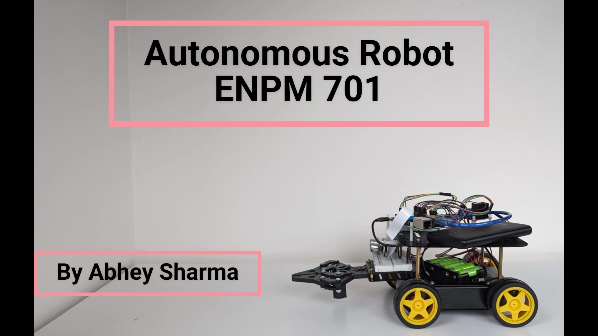

# Building-an-Autonomous-Robot-System

## Project Overview
This project involves developing an autonomous robotic system capable of completing the **Grand Challenge** outlined in the ENPM 701: Autonomous Robotics course. The robot must autonomously identify and collect color-coded blocks and transport them to a designated construction area while following specific constraints.

## Grand Challenge Requirements
### The robot must autonomously:
1. Identify and collect one block of each color (red, green, blue) for transport, one at a time.
2. Follow a strict sequence:  
   - First transport a **red block**, then a **green block**, then a **blue block**, and repeat the process.
3. Send an email to **ENPM809TS19@gmail.com** documenting each successful block pickup.
4. Transport the blocks from a cluttered environment to the designated **construction zone**.
5. Continue the process until all red, green, and blue blocks have been delivered.

### Constraints
- Students have **two attempts** to complete the challenge.
- **Passive data only**: No active real-time control of the robot is permitted during each run.
- The run **ends if**:
  1. The robot malfunctions or breaches the course boundary.
  2. The student calls a stop to the run.
  3. All required blocks are successfully delivered.
  4. **10 minutes** have elapsed.

## Installation & Setup
1. Clone this repository in your Raspberry Pi system:
   ```
   git clone https://github.com/your-username/Building-an-Autonomous-Robot-System.git
   cd Building-an-Autonomous-Robot-System
   ```
2. Run the grand_challenge script
  ```
  python3 grand_challenge.py
  ```

## Grand Challenge Video

[](https://www.youtube.com/watch?v=oj9UhtT2hsk&t=2s)
